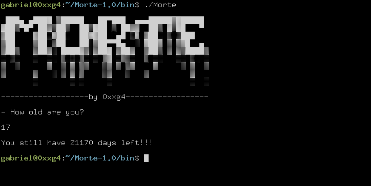

<h1 align="center">Morte</h1>
<p align="center">
  
</p>
<p align="center">
  death clock.
</p>

## Install

Download the `zip` file from [Releases Page](https://github.com/0xxg4/Morte/releases), extract it, go to `Morte-1.0/bin` and run it!

## Build

```shell

git clone https://github.com/0xxg4/Morte.git

cd Morte

./gradlew installDist

cd build/install/Morte/bin

./Morte (./Morte.bat if you are using windows)

```

## License

Copyright (C) 2020  Gabriel Polastrini

This program is free software: you can redistribute it and/or modify it under the terms of the GNU General Public License version 3, as published
by the Free Software Foundation.

This program is distributed in the hope that it will be useful, but WITHOUT ANY WARRANTY; without even the implied warranties of MERCHANTABILITY, SATISFACTORY QUALITY, or FITNESS FOR A PARTICULAR PURPOSE.  See the GNU General Public License for more details.

You should have received a copy of the GNU General Public License along with this program.  If not, see <http://www.gnu.org/licenses/>.
